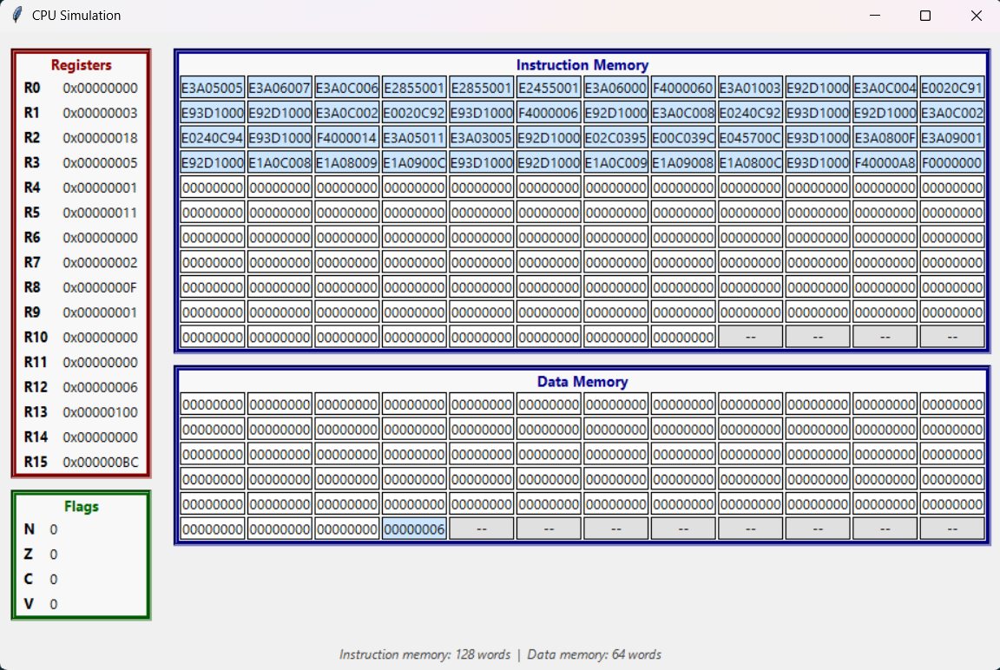
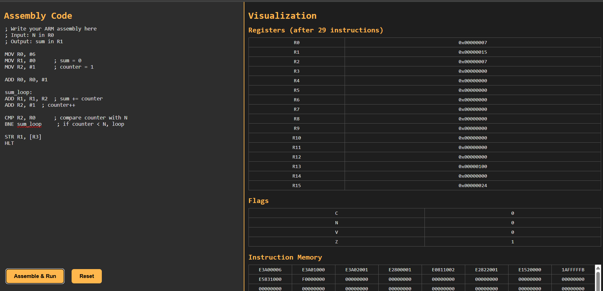

# ARM Assembly Simulator

## Project Description

The **ARM Assembly Simulator** is a modular Python-based tool that emulates the behavior of a simplified ARM-like processor.  
It includes all major stages of the instruction pipeline - from assembly translation to binary execution - allowing complete insight into how machine instructions are encoded, decoded, and executed.

- **Assembler** – Converts human-readable assembly code into 32-bit machine instructions, handling labels, immediates, and pseudo-instructions.
- **Encoder** – Implements the binary encoding rules for each instruction class (data processing, branch, stack, multiply/divide, system).
- **Decoder** – Interprets binary instructions during execution, identifying their type and dispatching the correct operation to the CPU.
- **CPU Core** – Simulates the processor’s registers, flags, and control flow, executing instructions through a fetch–decode–execute cycle.
- **Memory Module** – Provides byte-addressable read/write access for both program and data segments, including stack management.
- **System Interface** – Handles input/output operations (`INP`, `OUT`) and program termination (`HLT`), enabling simple interaction with the simulated environment.

Together, these components form a lightweight yet realistic model of an ARM-style architecture - ideal for understanding low-level computation, instruction encoding, and CPU execution flow.

---

## Features

- **Data Processing Instructions** – `MOV`, `ADD`, `SUB`, `CMP`, `AND`, `ORR`, `EOR`, `MVN`
- **Stack Operations** – `PUSH`, `POP` using R13 (SP)
- **Data Transfer Instructions** – `LDR`, `STR`
- **Branching** – `B`, `BL`, `RET`, `BEQ`, `BNE`, etc.
- **System Instructions** – `HLT`, `INP`, `OUT`
- **Pseudo-Instructions** – `INC`, `DEC`, `CLR`, `LSL`, `LSR`, `MOD`, `SWAP`
- **Debug Tools** – memory dump, register dump, and visualization helpers

## Local Interface

The local Tkinter-based interface provides a standalone desktop environment with a responsive code editor and real-time visualization of registers, flags, and memory, ideal for offline use and hands-on exploration of assembly execution.

## Web Interface

The web interface offers the same functionality as the desktop version, providing an intuitive, browser-based environment where users can write, assemble, and visualize ARM programs.

