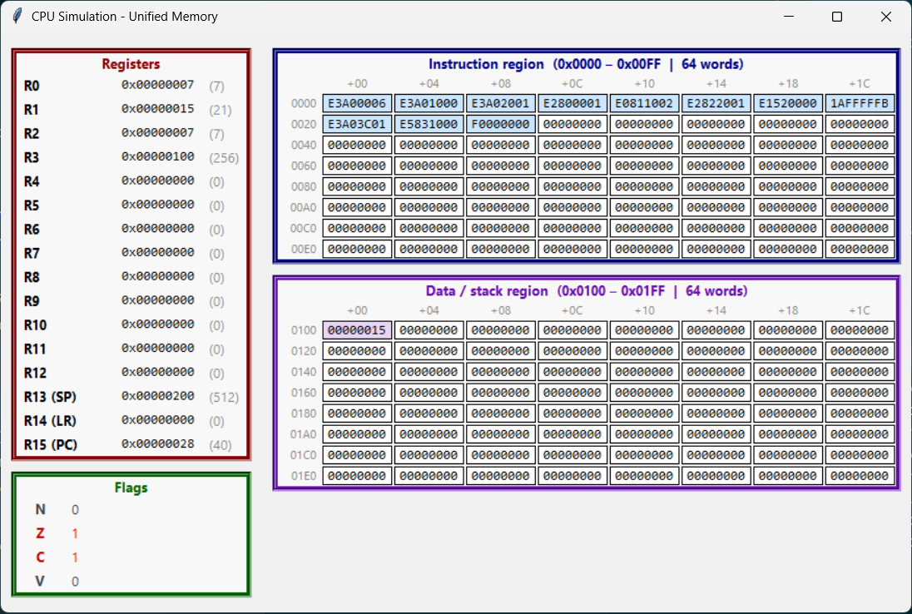
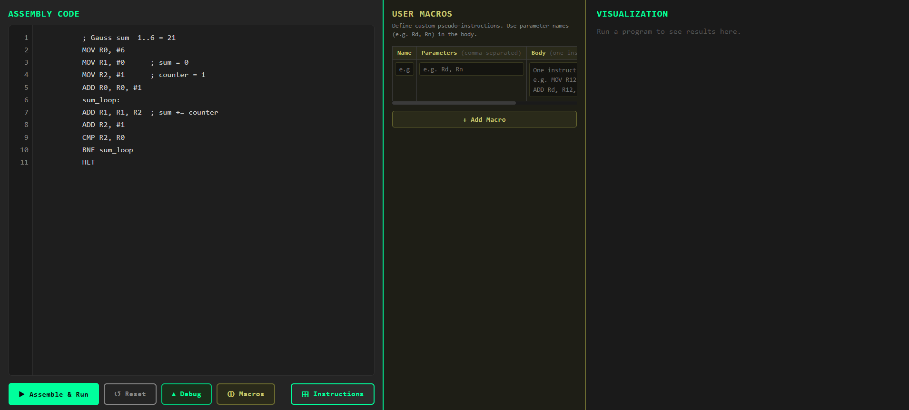

# ARM Assembly Simulator

A browser-based 32-bit ARM-inspired CPU simulator — write assembly, assemble it, watch registers and memory change, and step through execution with the built-in debugger.

**Live demo:** https://arm-assembly-simulator.onrender.com  
**Documentation:** [ARM Assembly Simulator Documentation](./\_docu/[Documentation ARM_Assembly_Simulator_V2.pdf)

---

## Project Description

The **ARM Assembly Simulator** is a modular Python-based tool that emulates the behavior of a simplified ARM-like processor.  
It includes all major stages of the instruction pipeline - from assembly translation to binary execution - allowing complete insight into how machine instructions are encoded, decoded, and executed.

- **Assembler** – Converts human-readable assembly code into 32-bit machine instructions, handling labels, immediates, and pseudo-instructions.
- **Encoder** – Implements the binary encoding rules for each instruction class (data processing, branch, stack, multiply/divide, system).
- **Decoder** – Interprets binary instructions during execution, identifying their type and dispatching the correct operation to the CPU.
- **CPU Core** – Simulates the processor’s registers, flags, and control flow, executing instructions through a fetch–decode–execute cycle.
- **Memory Module** – Provides byte-addressable read/write access for both program and data segments, including stack management.
- **System Interface** – Handles input/output operations (`INP`, `OUT`) and program termination (`HLT`), enabling simple interaction with the simulated environment.

Together, these components form a lightweight yet realistic model of an ARM-style architecture - ideal for understanding low-level computation, instruction encoding, and CPU execution flow.

---

## Instruction Set Summary

### Real instructions

| Group               | Mnemonics                                                         |
| ------------------- | ----------------------------------------------------------------- |
| Data processing     | `MOV` `ADD` `SUB` `RSB` `CMP` `TST` `AND` `ORR` `EOR` `BIC` `MVN` |
| Multiply / divide   | `MUL` `DIV`                                                       |
| Load / store (word) | `LDR` `STR`                                                       |
| Load / store (byte) | `LDRB` `STRB`                                                     |
| Stack               | `PSH` / `PUSH` `POP`                                              |
| Branch              | `B` `BEQ` `BNE` `BLT` `BGT` `BGE` `BLE` `JMS` `RET`               |
| System              | `HLT` `INP` `OUT`                                                 |

### Pseudo-instructions (assembler-expanded, no stack spill)

| Pseudo           | Expands to                         | Notes                     |
| ---------------- | ---------------------------------- | ------------------------- |
| `INC Rd`         | `ADD Rd, Rd, #1`                   | 1 word                    |
| `DEC Rd`         | `SUB Rd, Rd, #1`                   | 1 word                    |
| `CLR Rd`         | `MOV Rd, #0`                       | 1 word                    |
| `NOT Rd`         | `MVN Rd, Rd`                       | 1 word                    |
| `NEG Rd, Rn`     | `RSB Rd, Rn, #0`                   | 1 word                    |
| `LSL Rd, Rn, #n` | `MOV R12 + MUL`                    | 2 words                   |
| `LSR Rd, Rn, #n` | `MOV R12 + DIV`                    | 2 words                   |
| `ABS Rd, Rn`     | `CMP + MOV + BGE + RSB`            | 4 words                   |
| `ROL Rd, Rn, #n` | save R11 + shift both halves + ORR | 6 words, clobbers R11 R12 |
| `ROR Rd, Rn, #n` | save R11 + shift both halves + ORR | 6 words, clobbers R11 R12 |
| `MOD Rd, Rn, Rm` | `DIV + MUL + SUB` via R12          | 3 words                   |
| `SWAP Rn, Rm`    | `3× MOV` via R12                   | 3 words                   |
| `LOOP label`     | `SUB + CMP + BNE` via R12          | 3 words                   |
| `CALL label`     | `JMS label`                        | alias                     |
| `HALT`           | `HLT`                              | alias                     |

**Scratch registers:** R12 is the primary scratch for all pseudos. R11 is additionally used by ROL/ROR. Do not use R11 or R12 as operands to ROL/ROR, and avoid using R12 as a loop counter inside a loop body that also calls MOD.

---

## Debugger

Click **▲ Debug** to enter debug mode:

- **Step →** — execute one instruction; current line highlighted in the editor, changed registers marked with a green dot
- **Run »** — run continuously at ~120 ms/step
- **✕ Stop** — exit debug mode

The debugger is server-side session-based. State is serialised between steps so the browser can be refreshed without losing progress (within the 30-minute session window).

---

## Local Interface

The local Tkinter-based interface provides a standalone desktop environment with a responsive code editor and real-time visualization of registers, flags, and memory, ideal for offline use and hands-on exploration of assembly execution.

---

## Web Interface

The web interface offers the same functionality as the desktop version, providing an intuitive, browser-based environment where users can write, assemble, and visualize ARM programs.

You can try the simulator directly in your browser here:  
**[ARM Assembly Simulator Online](https://arm-assembly-simulator.onrender.com/)**

